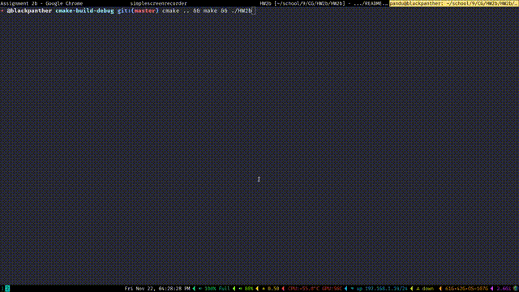

# opengl-2d-transformations

## description
- A simple implementation of some 2D transformations in opengl.

## roadmap
- Problems in `ps.md` are solved.

## code
- `ps.md` contains the problem statement.
- `ext/` contains libraries glad and glfw.
- `src/` contains all the source code.
- `github/` contains demonstrations.

## documentation
- The documentation for the code is itself.

## usage

### how to run? [linux]
- Assumes some opengl implementation is installed.
- Open a terminal at project root (the directory containing this file).
- Use the following for compilation which produces executable `HW2b`.
  - `mkdir build`
  - `cd build`
  - `cmake ..`
  - `make`
- Use `./HW2b` to run.

### controls
- `Click and drag` to rotate the rectangle.
- `Ctrl` + `Click and drag` to translate the rectangle.
- `Arrow keys` to scale rectangle along its width and height.
- `r` to reset everything to initial state.

## demonstration
Implementation is illustrated in the GIF below.

